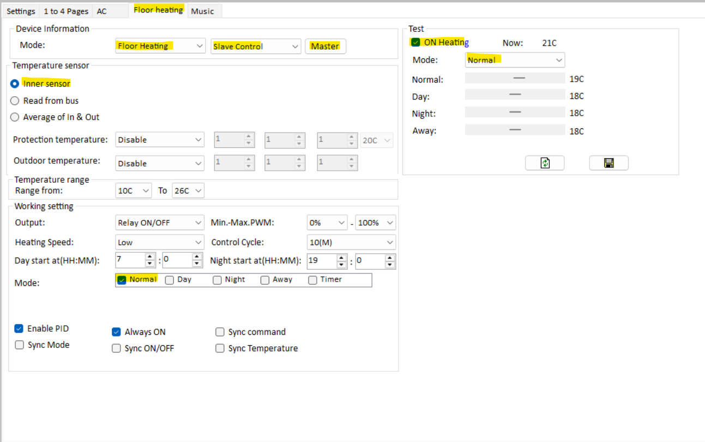
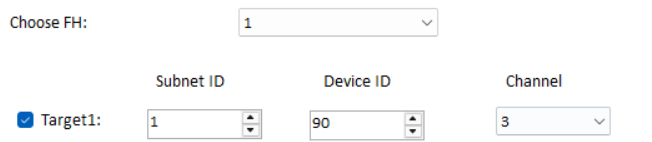
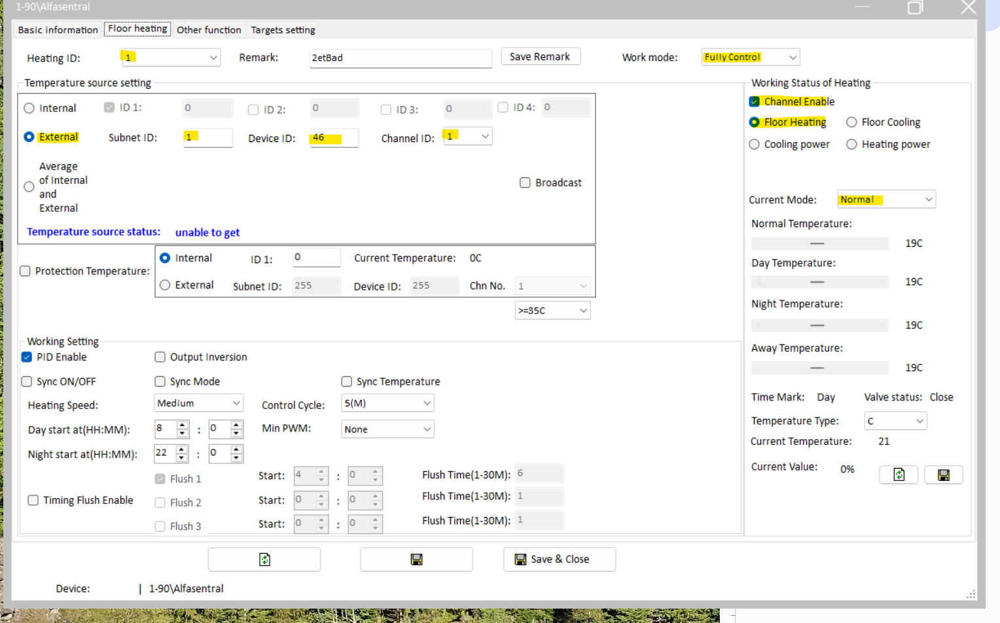

# HDL Heating Controller and Homey Pro

## Introduction

This guide explains how to connect and configure **HDL Heating Controllers** with **Homey Pro**.

HDL equipment comes in many flavours, with different firmware and setups, so your exact experience might not match this guide step for step. Think of this as a **general walkthrough** rather than a one-size-fits-all recipe.

⚠️ **Important**: This guide does not tell you anything about the equipment your heating controller is about to operate. Changing parameters such as speed, timing, flushing, control cycles and more from HDL SetupTool may have negative impacts on your heating system. If you disable logic from the heating controller that operates these features today, or override them using Homey later on, problems may occur. Understanding how your heating system works is paramount to a successful implementation.

## Before You Start

* You’ll need **HDL Setup Tool v2** installed.

* Back up everything using **HDL Setup Tool v2**, including heating controllers, DLP panels, logic controllers — basically all devices you’re about to change.

💡 **Tip**: Don’t do this for the first time in the middle of winter. If something breaks, you don’t want to be without heating.

## How the System Works

### The “Classic” HDL Setup

In most HDL homes *without* Homey Pro:

* **DLP panels** are configured as the *master*. They control temperature and operating mode, and they report temperature to the heating controller.

* **Heating controllers** are configured as *slaves*. They just execute what the DLP tells them.

* Some setups also include a **Logic Controller** for things like day/night or away modes through several integrations with the DLP Panels, usually highly dependent on UV-switches.  

### With Homey Pro

When you bring in Homey Pro, things change:

* Homey takes over as the brain behind your heating.

* DLPs are changed to “slaves”. They still report temperature and you can still adjust the temperature directly on the panel if you like.

* The heating controller is set as Master, which in turn is now controlled directly by Homey.

* All “operating modes” designed by HDL are disregarded, such as Home, Away, Night etc. 

📌 Changes made on the DLP automatically show up in Homey, and changes made in Homey show up on the DLP.

## 

## Configuration

### Step 1 – Prepare Homey

* Add all heating channels from your heating controller into Homey Pro.

* Check that every channel is visible and reporting a temperature. Doesn’t need to be a correct temperature, but a temperature nonetheless.

* Remove any heating logic from your HDL Logic Controller. If you don’t, it may conflict with Homey and cause strange behavior. 

### Step 2 – Set Up DLP Panels

👉 It’s a good idea to test **one zone first**. When it works, repeat for the rest.

1. Open a DLP in the HDL **Setup Tool**.

2. Open the tab for **Floor Heating**.

   * Refresh first to make sure you’re looking at the latest config.

3. Change the DLP role from **Master → Slave**.

   * Click the button “Master” and enter the address of your heating controller and which channel it should operate. 

4. Do you use the **Inner Sensor**?

   * This is usually on by default. It reports ambient temperature from the DLPs to both Homey Pro and the heating controller.

   * If you use other HDL-sensors, you’ll need to configure those later in the heating controller.  
   

5. Set the **Mode** to *Normal*. Disable Day, Night, Away, and Timer.

6. Leave things like **PID, Always-On, Sync** alone unless you actually want to change them. If PID is already enabled, it’s probably for a good reason. Disabling it can cause issues. 

7. Save.

👉 Double-check that the DLP’s **master address** points to your heating controller and with the corresponding ID. 

Figure 1: Typical Floor Heating tab. Inner sensor enabled to report the temperatur on the bus. Temperature range set to force an upper and lower limit. Mode: All modes except “Normal” is checked. My heating must always be on (remember to also set this in Homey\!) and I require PID in my heating syste,.   

Figure 2: When clicking the “Master” button as seen in figure 1, this menu appears. Subnet and Device ID is self-explanatory. Channel is the heating channel.   

---

### Step 3 – Configure the Heating Controller

1. Open the Heating Controller in **HDL Setup Tool**

2. Refresh to load the latest configuration.

3. For each heating ID:

   * Set **Work Mode** to *Fully Control (Master)*.

   * Set **Temperature Source** to *External* and enter the matching DLP address.

   * Enable the channel.

   * Select the correct heating type.

   * Set **Current Mode** to *Normal*.

   * Save before moving to the next one\! If you do several each time, please save for each ID completed. 

### Step 4 \- Testing

Once configuration is done:

* All enabled heating channels should now show up in Homey.

* It can take a few minutes for everything to sync.

* Check:

  * Temperature changes in Homey update the heating controller (you can confirm in Setup Tool with *Refresh*).

  * DLPs are in *Normal Mode*.

  * Changes in Homey reflect on DLPs, and vice versa.

  * The Heating Controller Module actually operates your heating system within the parameters set during configuration. 

## Troubleshooting

* **Missing channels in Homey** → Re-add them via the Homey HDL app, then refresh in Setup Tool.

* **System not responding** → Give it 30 minutes and try again. If the system still is not responding, consider restoring a backup.

* **Temperatures don’t update** → Check the sensor setup (inner vs external). Verify temperature readings on the DLP-panel. Remember, DLP temperatures aren’t the most reliable sources for temperature, so flows set up in Homey might have to “push” the heating controller with greater temperature changes to get it working correctly. 

* **Unstable or conflicting behavior** → Make sure the old Logic Controller heating logic is disabled.

## 

## Homey Automation Considerations

* **Consider DLP user input:** When creating automations in Homey, consider what should happen if a user changes a temperature manually on the DLP, should the automation be postponed for an hour, 12 hours, disabled etc. Think through this carefully.

* **Leveraging more inputs than temperature:** Homey provides some excellent opportunities to include more advanced heating controls. Delta-temperature, rapid changes in outside temperature, movement-sensors, power-usage and electricity pricing. Several new possibilities are available to make your heating plan more flexible and powerful\! 

* **Enable DLP UV-switches to create automations in Homey:** Using DLP buttons to send UV-switches to Homey that trigger specific flows can be a powerful tool for people with no access to your Homey environment, such as guests or children. I.e. increase the heat for 12 hours for a specific zone etc. 

* **Automatic HDL Programs such as flushing, are overridden by Homey:**If you use flushing, this might be overridden by temperature-adjustments or flows running from Homey. Homey can't trigger flushing directly, but can simulate similar procedures using carefully planned flows. This might be tricky during the summer, when indoor temperatures can exceed established temperature thresholds. If you require flushing in your heating-system, disabling flows automatically when flushing occurs solved it for me. 

* **Leveraging flows together with sensors (ie. motion) can be a great source for saving energy:** We automatically reduce our indoor temperature when no motion has been detected in our house for 24 hours. This is especially useful if household members have increased the temperatures without regard for policy or common sense (*https://www.youtube.com/watch?v=C05qUz1ukWo)*. Using sensors, schedules or simple UV-switches leveraged by Homey to get the “most comfort for your buck” is both interesting and fun to experiment with. 

